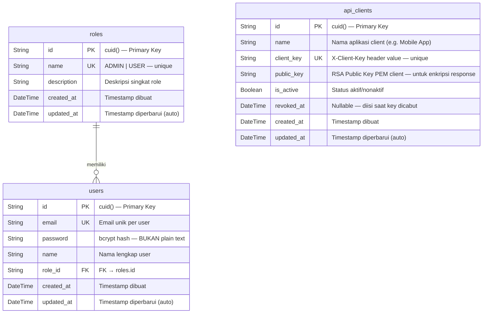
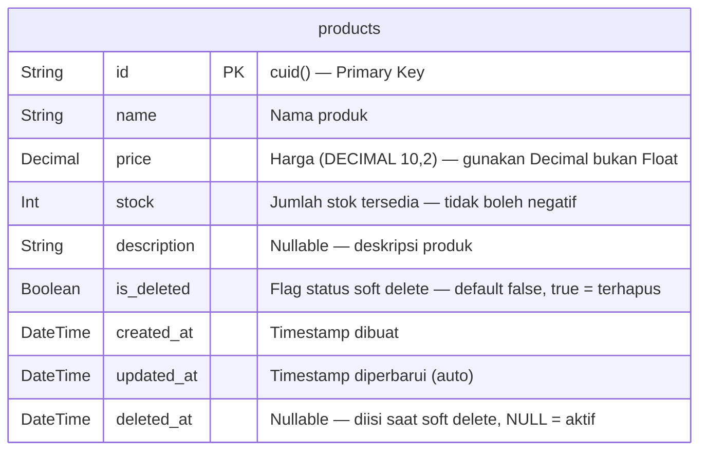
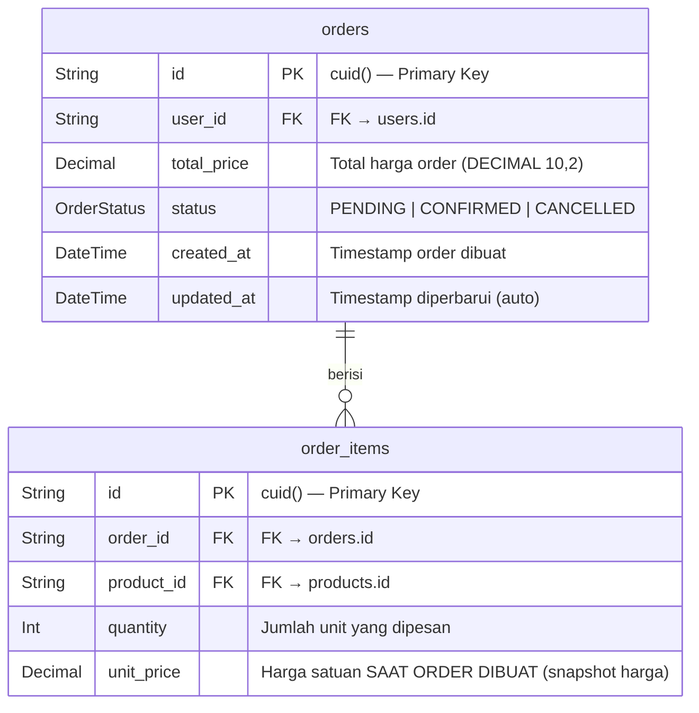
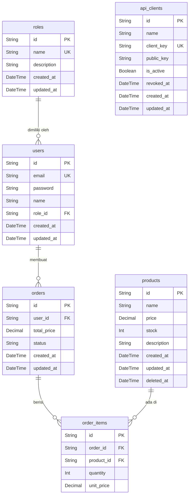

# Entity Relationship Diagram — Solutech Backend

Dokumen ini mendeskripsikan desain database untuk REST API e-commerce Solutech.
Database dibagi dalam **3 schema group** berdasarkan domain masing-masing.

---

## Schema Overview

```
┌─────────────────────────────────────────────────────────────────────┐
│                         DATABASE SCHEMAS                            │
│                                                                     │
│  ┌──────────────────┐   ┌─────────────────┐   ┌─────────────────┐  │
│  │  MASTER SCHEMA   │   │ PRODUCT SCHEMA  │   │  TRANSACTION    │  │
│  │                  │   │                 │   │    SCHEMA       │  │
│  │  • roles         │   │  • products     │   │  • orders       │  │
│  │  • users         │   │                 │   │  • order_items  │  │
│  │  • api_clients   │   │                 │   │                 │  │
│  └──────────────────┘   └─────────────────┘   └─────────────────┘  │
│                                                                     │
│  Relasi antar schema:                                               │
│  users ──────────────────────────────────────> orders              │
│  products ───────────────────────────────────> order_items          │
└─────────────────────────────────────────────────────────────────────┘
```

---

## 1. Master Schema

Mengelola identitas pengguna, hak akses (role), dan registrasi API client untuk enkripsi.



### Keterangan Tabel Master

| Tabel | Tujuan |
|---|---|
| `roles` | Mendefinisikan hak akses: `ADMIN` (full access), `USER` (beli saja) |
| `users` | Akun pengguna — password disimpan sebagai bcrypt hash (cost factor 10) |
| `api_clients` | Registrasi aplikasi client yang diizinkan mengakses API dengan enkripsi payload |

> **Catatan `api_clients`**: Tabel ini hanya aktif jika `ENCRYPTION_ENABLED=true`.
> `revoked_at` diisi untuk menonaktifkan client — record tidak pernah dihapus agar audit trail tetap ada.

---

## 2. Product Schema

Mengelola katalog produk yang dijual, termasuk stok dan soft delete.



### Keterangan Tabel Product

| Field | Type | Constraint | Alasan Desain |
|---|---|---|---|
| `id` | `String` | `PK, cuid()` | CUID lebih aman dari sequential integer (tidak bisa ditebak) |
| `name` | `String` | `NOT NULL` | Nama wajib ada |
| `price` | `Decimal(10,2)` | `NOT NULL, > 0` | Decimal menghindari floating point error (hindari `Float`!) |
| `stock` | `Int` | `NOT NULL, >= 0` | Tidak boleh negatif — divalidasi di service layer |
| `description` | `String?` | `NULL allowed` | Opsional |
| `is_deleted` | `Boolean` | `NOT NULL, default false` | **Flag status soft delete**: `false` = aktif, `true` = terhapus |
| `deleted_at` | `DateTime?` | `NULL = aktif` | **Timestamp soft delete**: Waktu produk dihapus |

> **Soft Delete Rule**: Setiap query `SELECT` pada `products` **WAJIB** menyertakan `WHERE is_deleted = false AND deleted_at IS NULL`.
> Record dengan `is_deleted = true` / `deleted_at IS NOT NULL` dianggap "terhapus" dan tidak boleh muncul di API response.

---

## 3. Transaction Schema

Mengelola pembuatan order beserta item-itemnya. Semua operasi harus berjalan dalam database transaction.



### Keterangan Tabel Transaction

| Tabel | Tujuan |
|---|---|
| `orders` | Header order — berisi informasi pemesan, total harga, dan status |
| `order_items` | Line item order — setiap produk dalam order menjadi satu baris |

#### Penjelasan Field Kritis

| Field | Alasan Desain |
|---|---|
| `orders.total_price` | Dihitung saat order dibuat: `SUM(unit_price × quantity)`. Disimpan agar tidak berubah jika harga produk berubah kemudian |
| `orders.status` | Enum: `PENDING` (baru dibuat), `CONFIRMED` (diproses), `CANCELLED` (dibatalkan) |
| `order_items.unit_price` | **SNAPSHOT harga saat order** — bukan harga product saat ini. Ini critical untuk integritas data keuangan historis |
| `order_items.quantity` | Jumlah unit — digunakan untuk mengurangi `products.stock` dalam transaction |

> **Transaction Rule**: Pembuatan order melibatkan:
> 1. `SELECT` produk + validasi stok
> 2. `INSERT` order
> 3. `INSERT` order_items (banyak rows)
> 4. `UPDATE` products.stock (decrement)
>
> **Semua langkah ini HARUS dalam satu `prisma.$transaction`**.
> Jika satu langkah gagal → seluruh operasi di-rollback.

---

## 4. ERD Lengkap (Semua Schema)

Diagram berikut menunjukkan seluruh relasi antar tabel di semua schema:



---

## 5. Kardinalitas Relasi

| Relasi | Tipe | Keterangan |
|---|---|---|
| `roles` → `users` | **1 to Many** | Satu role bisa dimiliki banyak user |
| `users` → `orders` | **1 to Many** | Satu user bisa memiliki banyak order |
| `orders` → `order_items` | **1 to Many** | Satu order berisi satu atau lebih item |
| `products` → `order_items` | **1 to Many** | Satu product bisa muncul di banyak order |

---

## 6. Enum Definitions

```sql
-- Tipe status order
CREATE TYPE "OrderStatus" AS ENUM (
  'PENDING',      -- Order baru dibuat, menunggu konfirmasi
  'CONFIRMED',    -- Order dikonfirmasi dan diproses
  'CANCELLED'     -- Order dibatalkan (stok dikembalikan)
);

-- Tipe role user
CREATE TYPE "RoleName" AS ENUM (
  'ADMIN',   -- Akses penuh: CRUD product, lihat semua order
  'USER'     -- Akses terbatas: hanya bisa membuat dan melihat order sendiri
);
```

---

## 7. Indexing Strategy

Index yang direkomendasikan untuk performa query:

```sql
-- Index untuk soft delete filter (query produk aktif)
CREATE INDEX idx_products_deleted_at ON products(deleted_at);

-- Index untuk search produk berdasarkan nama
CREATE INDEX idx_products_name ON products(name);

-- Index untuk query order berdasarkan user
CREATE INDEX idx_orders_user_id ON orders(user_id);

-- Index untuk lookup order items
CREATE INDEX idx_order_items_order_id ON order_items(order_id);
CREATE INDEX idx_order_items_product_id ON order_items(product_id);

-- Index untuk lookup api_client berdasarkan client_key (sudah ada via @unique)
-- Prisma otomatis membuat index untuk field @unique
```

> **Catatan**: Prisma otomatis membuat index untuk field yang memiliki `@unique` atau `@id`.
> Index tambahan di atas perlu didefinisikan manual menggunakan `@@index` di schema Prisma.

---

## 8. Data Flow Diagram

### Flow: Create Order

```
Client Request
     │
     ▼
[Auth Middleware]     ─── Verifikasi JWT token
     │
     ▼
[Validasi Input]      ─── Zod: items array tidak kosong, quantity > 0
     │
     ▼
[BEGIN TRANSACTION]
     │
     ├─► SELECT products WHERE id IN (:productIds) AND deleted_at IS NULL
     │         │
     │         ├─ Validasi: semua produk ditemukan?
     │         └─ Validasi: stock >= quantity untuk setiap item?
     │
     ├─► INSERT INTO orders (user_id, total_price, status='PENDING')
     │
     ├─► INSERT INTO order_items (order_id, product_id, quantity, unit_price)
     │         └─ unit_price = price produk SAAT INI (snapshot)
     │
     └─► UPDATE products SET stock = stock - quantity WHERE id = :productId
              └─ Untuk setiap item dalam order (paralel dengan Promise.all)

[COMMIT TRANSACTION]  ─── Jika semua langkah berhasil
     │
     ▼
Response 201 Created
```

---

*Dokumen ini merupakan referensi desain database untuk project Solutech Backend.*
*Setiap perubahan schema di `prisma/schema.prisma` harus direflesikan di dokumen ini.*
*Terakhir diperbarui: 2026-08-07*
